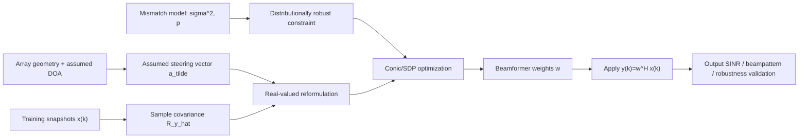

I found the paper: [RMVB.pdf](/Users/princekp/RMVB/RMVB.pdf). Since you wrote “equations [X through Y]” as a placeholder, I’ll cover the main implementation path: equations `(1)–(12)`, baseline robust beamformers `(13)–(22)`, and the proposed DR beamformer `(24)–(32)`.

**1. Logical Architecture**



The paper’s core idea is:

> Choose beamformer weights `w` that minimize output power while guaranteeing the desired signal is not suppressed, even when the steering vector is uncertain.

Classic Capon/MVB assumes the steering vector is exactly known. This paper says: “We only know the mismatch has zero mean and covariance `sigma^2 I`; we do not know its full distribution.” That is the distributionally robust part.

**2. Equation-To-Logic Translation**

Equations `(1)–(2)` are the signal model:

```text
x(k) = s(k)a + i(k) + n(k)
y(k) = w^H x(k)
```

Plain English: each sensor receives the desired signal, interference, and noise. The beamformer forms a weighted sum of all sensors. The weights `w` are what we need to learn.

Equation `(6)` is the ideal Capon/MVB problem:

```text
minimize    w^H R_y_hat w
subject to  w^H a = 1
```

It says: minimize output energy, but force the desired signal direction to pass through unchanged. The problem is that true `a` is not known perfectly.

Equations `(7)–(9)` introduce robustness:

```text
Re{w^H a} >= 1
a = a_tilde + delta
```

Now the steering vector is assumed vector plus mismatch. Instead of exact equality, the response must stay at least `1`. This avoids accidentally nulling the desired signal.

Equations `(10)–(12)` convert complex math into real-valued math:

```text
w_complex -> [Re(w); Im(w)]
a_complex -> [Re(a); Im(a)]
R_complex -> real block matrix R
```

This is mainly for optimization solvers. Most conic/SDP solvers operate more naturally on real variables.

Equations `(13)–(17)` are the worst-case robust beamformer:

```text
for all ||delta|| <= eta:
    w^T(a_tilde + delta) >= 1
```

Plain English: assume the steering error can be anything inside a ball of radius `eta`. Protect against the absolute worst point in that ball.

Equation `(17)`:

```text
eta ||w|| <= w^T a_tilde - 1
```

The left side is the worst possible loss due to mismatch. The right side is the safety margin above the minimum required response.

Equations `(18)–(22)` are the Gaussian robust beamformer:

```text
Pr[w^T(a_tilde + delta) >= 1] >= p
```

Plain English: instead of protecting against every possible mismatch, require that the constraint holds with probability at least `p`, assuming `delta` is Gaussian.

Equation `(24)` defines the ambiguity set:

```text
P = all distributions where E[delta] = 0 and E[delta delta^T] = sigma^2 I
```

This is the heart of the paper. We do not know whether the mismatch is Gaussian, mixture-Gaussian, impulsive, or weird. We only know its first two moments.

Equations `(25)–(26)` define the proposed DR beamformer:

```text
minimize    w^T R w
subject to  worst_distribution_probability >= p
```

Plain English: among every distribution consistent with the known mean and covariance, even the worst one must satisfy the beamformer constraint with probability at least `p`.

Equations `(27)–(32)` are the tractable reformulation:

```text
minimize tau
subject to:
    ||Lw|| <= tau
    beta + 1/(1-p) Tr(Omega M) <= 0
    M + block_matrix(w, a_tilde, beta) >= 0
    M >= 0
```

This turns the abstract “worst distribution” chance constraint into a semidefinite program. `M` and `beta` are auxiliary variables introduced by the CVaR/moment-robust reformulation. You do not interpret them as physical beamformer weights; they are proof machinery that makes the problem solvable.

One practical note: the paper text says `M in S^{2MN+1}` in one place, but for this array-only formulation it should behave like a `(2M+1) x (2M+1)` symmetric matrix after converting complex variables to real form.

**3. Algorithmic Pseudocode**

Here is the mathematical flow without relying on advanced libraries yet.

```text
Inputs:
    M                  number of sensors
    K                  number of snapshots
    x[0:K-1]           complex sensor snapshots, each length M
    theta_assumed      assumed desired direction
    sigma2             mismatch variance
    p                  required probability
    array_spacing      usually lambda / 2

Build assumed steering vector:
    for m in 0 to M-1:
        a_tilde_complex[m] = exp(j * pi * m * sin(theta_assumed))

Estimate sample covariance:
    R_y_hat = zero complex M x M matrix
    for k in 0 to K-1:
        R_y_hat += x[k] * x[k]^H
    R_y_hat = R_y_hat / K

Convert to real-valued form:
    w_real has length 2M
    a_tilde_real = [real(a_tilde_complex); imag(a_tilde_complex)]

    R_real = [[ real(R_y_hat), -imag(R_y_hat)],
              [ imag(R_y_hat),  real(R_y_hat)]]

Factor covariance:
    find L such that R_real = L^T L
    if R_real is ill-conditioned:
        use R_real + small_diagonal_loading * I

Build DR ambiguity matrix:
    Omega = [[(sigma2 / 2) * I_(2M), 0],
             [0,                    1]]

Decision variables:
    w_real length 2M
    tau scalar
    beta scalar
    M_aux symmetric matrix size (2M+1) x (2M+1)

Optimization objective:
    minimize tau

Constraint 1:
    norm(L * w_real) <= tau

Constraint 2:
    beta + (1 / (1-p)) * trace(Omega * M_aux) <= 0

Constraint 3:
    construct B:
        B = [[0,                 0.5 * w_real],
             [0.5 * w_real^T,    w_real^T a_tilde_real + beta - 1]]

    require:
        M_aux + B is positive semidefinite

Constraint 4:
    M_aux is positive semidefinite

Solve optimization.

Recover complex beamformer:
    w_complex = w_real[0:M] + j * w_real[M:2M]

Apply beamformer:
    for each new snapshot x:
        y = w_complex^H * x
```

For simulation validation:

```text
Generate desired signal, interference, and noise:
    for each snapshot k:
        x[k] = s[k] * a_true
             + sum_over_interferers q_i[k] * a_interferer_i
             + noise[k]

Compute beamformer output SINR:
    numerator   = signal_power * |w^H a_true|^2
    denominator = w^H R_interference_noise w
    SINR_out    = numerator / denominator
```

**4. Step-By-Step Implementation Plan**

Start small. Do not implement the full DR optimizer first.

1. Implement steering vector generation.

Verify:
```text
a(theta)[0] should be 1
|a(theta)[m]| should be 1 for all m
```

2. Implement complex-to-real conversion.

Verify:
```text
w_complex^H R_complex w_complex
equals
w_real^T R_real w_real
```

This is a great first unit test.

3. Implement sample covariance estimation.

Use synthetic snapshots. Verify:
```text
R_y_hat is Hermitian
eigenvalues are nonnegative or nearly nonnegative
```

4. Implement ordinary Capon/MVB first.

Closed form:

```text
w = R^-1 a / (a^H R^-1 a)
```

This gives you a sanity baseline before touching robust optimization.

5. Implement worst-case robust beamformer.

This is simpler than DR and uses the constraint:

```text
eta ||w|| <= w^T a_tilde - 1
```

If this works, your real-valued formulation is probably correct.

6. Implement Gaussian robust beamformer.

Same structure, but replace `eta` with:

```text
sigma * erf_inverse(2p - 1)
```

7. Implement DR beamformer last.

Use an SDP solver such as `cvxpy` for the first real implementation. Writing an SDP solver from scratch is not the useful research-engineering path here; the paper itself uses CVX.

8. Reproduce Fig. 1 or Fig. 2.

Use:
```text
M = 5
K = 80
interferer DOAs = 20 deg, 50 deg
INR = 20 dB
assumed theta = 5 deg
1000 Monte Carlo trials
```

**5. Validation Strategy**

At each stage, validate one layer only.

For steering vectors:
```text
Check shape: (M,)
Check magnitude: all entries have abs ~= 1
Check theta = 0 gives all phase increments aligned
```

For real conversion:
```text
random complex w
random Hermitian R
assert close(w^H R w, w_real^T R_real w_real)
assert close(Re(w^H a), w_real^T a_real)
```

For covariance:
```text
R_y_hat ~= R_y_hat^H
min eigenvalue >= small negative tolerance
```

For Capon:
```text
w^H a_tilde ~= 1
objective decreases compared with random feasible weights
```

For worst-case robust:
```text
w^T a_tilde - 1 >= eta ||w||
```

Then sample random `delta` with `||delta|| <= eta` and verify:

```text
w^T(a_tilde + delta) >= 1
```

For Gaussian robust:
simulate many random Gaussian mismatches and estimate:

```text
mean( w^T(a_tilde + delta) >= 1 ) >= p
```

For DR robust:
simulate multiple mismatch distributions, not just Gaussian:

```text
Gaussian
Gaussian mixture
uniform-on-ball
heavy-tailed / impulsive mixture
```

The DR beamformer should be less fragile when the mismatch distribution is non-Gaussian.

For paper-level validation:
compare output SINR curves against Fig. 1 and Fig. 2. You probably will not match pixel-perfect because random seeds, solver tolerances, and covariance estimation details matter, but the ordering should be similar:

```text
DR beamformer usually highest or near-highest SINR
Gaussian robust weaker under non-Gaussian mismatch
worst-case robust conservative when eta is large
```

The key implementation milestone is this: before coding the full DR SDP, make sure your complex-to-real conversion and SINR computation are unquestionably correct. Those two pieces are where small mistakes quietly ruin the entire reproduction.